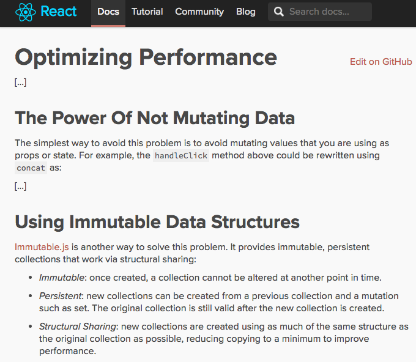
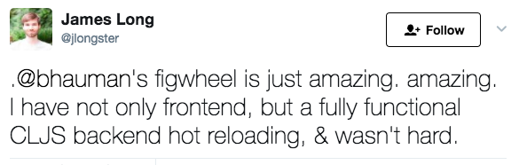
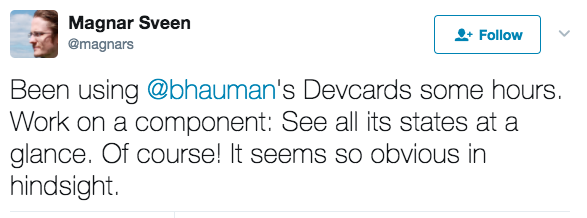

<!SLIDE react bullets incremental>

# React.js

* A library for building composable user interfaces

* Functional and declarative approach

<!SLIDE react>

<!SLIDE react>

# React.js

Js + JSX:

    @@@ Javascript
    class HelloMessage extends React.Component {
      render() {
        return 
Hello {this.props.name}
;
      }
    }

    ReactDOM.render(<HelloMessage name="John" />, mountNode);

<!SLIDE react bullets incremental transition=fade>

# React.js

Cljs + reagent:

    @@@ Clojure
    (defn hello-message [props]
      [:div "Hello " (:name props)])

    (reagent/render [hello-message {:name "John"}] mountNode)

* React Wrappers: Om, **Reagent**, Quiescent, Rum

<!SLIDE reagent incremental>

# Reagent

"A minimalistic ClojureScript interface to React.js"

* Create React components using (almost) just plain ClojureScript functions

* J̶S̶X̶ Hiccup

<!SLIDE reagent>

# Reagent

"A minimalistic ClojureScript interface to React.js"

* Create React components using (almost) just plain ClojureScript functions

* J̶S̶X̶ Hiccup

Example:

    @@@ clojure
    (defn todos-view [todos]
     [:div {:text-align "center"}
      [:h3 "Todos"]
      [:ul#todos
       (for [todo todos]
         [:li.todo
          (:description todo)
          [delete-todo-btn todo]]]

<!SLIDE re-frame bullets incremental>

# Re-frame

* Built on top of reagent

* Redux-like library

* Single store (atom)

* State changed via event/handler (action/reducer)

* One-way data flow: handlers -> store -> view

* Logging, time-travel, hot-reload, record & replay

<!SLIDE interactive bullets incremental>

# Interactive development

* Reduce feedback loop

* REPL (**R**ead-**E**val-**P**rint-**L**oop)
* Devcards
* Hot-reload (Figwheel, Boot-reload)

~~~SECTION:notes~~~
Time from saving file to see changes

Easier ways to interact with your code
~~~ENDSECTION~~~

<!SLIDE figwheel-devcards-tweets>

 

<!SLIDE demo inverse>

# DEMO

<!SLIDE references>

# References/Links

ClojureScript official site - https://clojurescript.org/

Using React.js with ClojureScript - Arne Brasseur (Lambda Island) - https://www.youtube.com/watch?v=Sbej4OYTwjg

Idée Fixe - David Nolen - GOTO 2017 - https://www.youtube.com/watch?v=lzXHMy4ewtM

Developing ClojureScript With Figwheel - Bruce Hauman - https://www.youtube.com/watch?v=j-kj2qwJa_E

Why I chose ClojureScript over JavaScript - akiroz - https://m.oursky.com/why-i-chose-clojure-over-javascript-24f045daab7e
