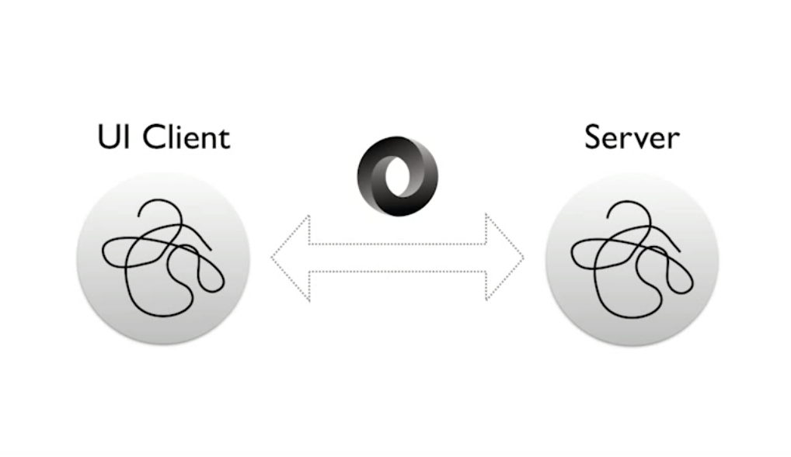
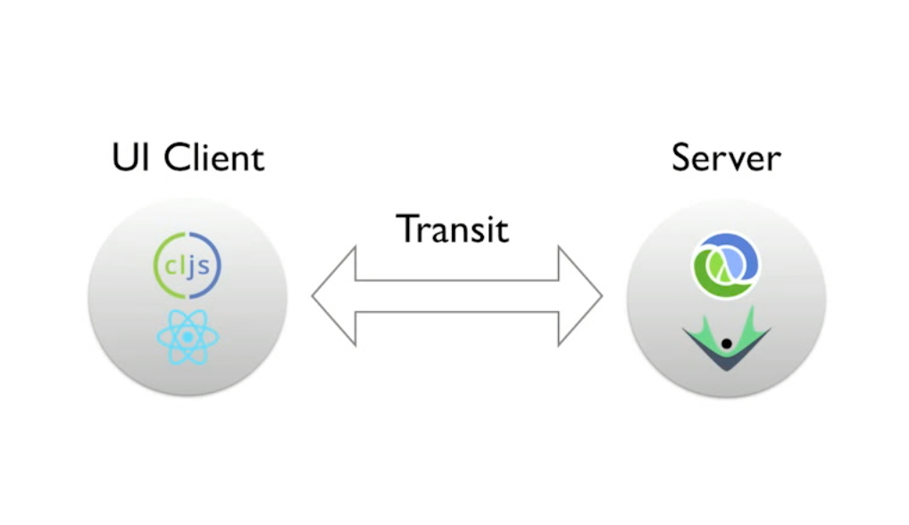
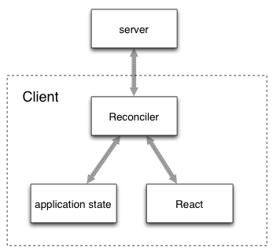
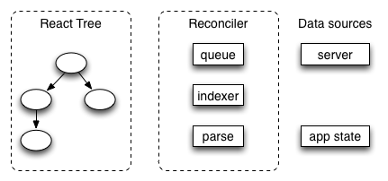

<!SLIDE title-slide>

# Introducción a om.next #

## Clojure User Group Buenos Aires ##
### 25/11/2015 ###
### por Nicolás Berger ###

<!SLIDE bullets>

# Por qué om.next

#### Fuente: [Om Next - David Nolen - Clojure/Conj 2015](https://www.youtube.com/watch?v=MDZpSIngwm4)
<!SLIDE bullets>

# Por qué om.next

#### Fuente: [Om Next - David Nolen - Clojure/Conj 2015](https://www.youtube.com/watch?v=MDZpSIngwm4)

<!SLIDE bullets>

# No es suficiente

* Multiples clientes (browser, mobile, watch, apps)
* Comunicacion cliente-servidor ad-hoc (out-of-band information)
* React se complica cuando la UI es un grafo, no un tree (flux, redux)
* BFF (Backend For Frontend)

<!SLIDE bullets>

# Modelo simple

* Single atom app state
* No asincronico (excepto en la frontera)
* Sin modelo de eventos visible (excepto en la frontera)

<!SLIDE bullets>

# Objetivos

* Forma simple de hacer lecturas no triviales
* Forma simple de comunicar novedades no triviales

<!SLIDE bullets>

* Como hacemos *requests precisos*?
* Como el server responde a *requests precisos*?
* Como el cliente comunica *novedades precisas*?
* Como el server comunica *identidad para novedades no triviales*
* Integrar novedades en el cliente?
* Local state en el cliente?

<!SLIDE bullets>

* Optimistic updates?
* Testing?
* Recursive UIs?
* Caching?
* Custom client storage?
* Custom server storage?
* Streaming?

<!SLIDE bullets>

# Vamos por partes

* Query & identity
* Components
* Parsing & mutation
* Normalization
* Reconciler
* Remote integration

<!SLIDE bullets>

# Query Expressions

* Fragmentos de query co-located en UI
* Query completo -> single request

        @@@ clojure
        (defui Person
          static om/IQuery
          (query [this]
            `[:ui/checked :db/id :person/name
              {:person/mate ...}])
          ...)

<!SLIDE bullets>

# Components

        @@@clojure
        (defui Person
          static om/Ident
          (ident [this {:keys [name]}])
          static om/IQuery
          (query [this] `[:name :points])
          Object
          (render [this] ...))

        (defui PeopleList
          static om/IQuery
          (query [_] `[{:people/list ~(om/get-query Person)}])
          Object
          (render [this]
            (dom/div
              (dom/h1 nil "People"
              (apply dom/ul #js {:style #js {:padding 0}}
                (map person (:people/list (om/props this))))))
<!SLIDE bullets>

# Query Expressions

* Parameterized
* Joins
* Unions (heterogeneous data)
* Recursive

<!SLIDE bullets>

# Parsing

* Evaluacion del query
* QueryExpr -> EdnValue (for the UI)

        @@@clojure
        (defn read :some-key [env key params]
          {:value cached-value-from-env
           :server-1 query-fragment})

<!SLIDE bullets>

# Normalization

        @@@clojure
        (def init-data
          {:list/one [{:name "John" :points 0}
                      {:name "Mary" :points 0}
                      {:name "Bob"  :points 0}]
           :list/two [{:name "Mary" :points 0 :age 27}
                      {:name "Gwen" :points 0}
                      {:name "Jeff" :points 0}]})

<!SLIDE bullets>

# Normalization

        @@@clojure
        {:list/one
         [[:person/by-name "John"]
          [:person/by-name "Mary"]
          [:person/by-name "Bob"]],
         :list/two
         [[:person/by-name "Mary"]
          [:person/by-name "Gwen"]
          [:person/by-name "Jeff"]],
         :person/by-name
         {"John" {:name "John", :points 0},
          "Mary" {:name "Mary", :points 0, :age 27},
          "Bob" {:name "Bob", :points 0},
          "Gwen" {:name "Gwen", :points 0},
          "Jeff" {:name "Jeff", :points 0}}}

<!SLIDE bullets>

# Reconciler

### Cambios en app state -> views
### Transact new data into app state
### Initial loading for whole app
### Optimistic writes

<!SLIDE bullets>

# Reconciler

<!SLIDE bullets>

# Remote integration

### Multiple remotes
### `read` responsable de fragmentar query entre local y remotes
### `send` fn para cada remote
### HTTP caching: read debe separar query en :dynamic y :static

<!SLIDE bullets>

# Testing

https://github.com/omcljs/om/wiki/Applying-Property-Based-Testing-to-User-Interfaces

        @@@clojure
        (gen/sample gen-tx-add-remove 10)
        ;; ([]
        ;;  [(friend/add {:id 1, :friend 1}) (friend/remove {:id 1, :friend 2})]
        ;;  [(friend/add {:id 0, :friend 0}) (friend/remove {:id 0, :friend 1})
        ;;   (friend/add {:id 0, :friend 1})]

        (defn prop-no-self-friending []
          (prop/for-all [tx gen-tx-add-remove]
            (let [parser (om/parser {:read read :mutate mutate})
                  state  (atom (om/tree->db People init-data true))]
              (parser {:state state} tx)
              (let [ui (parser {:state state} (om/get-query People))]
                (not (some self-friended? (:people ui)))))))

<!SLIDE bullets>

# Demo time!

<!SLIDE bullets>

# Referencias

https://github.com/omcljs/om/wiki/Quick-Start-(om.next)
https://www.youtube.com/watch?v=MDZpSIngwm4
http://www.martinklepsch.org/posts/om-next-reading-list.html
https://medium.com/@kovasb/om-next-the-reconciler-af26f02a6fb4
https://www.thoughtworks.com/radar/techniques/bff-backend-for-frontends

<!SLIDE bullets>

# Gracias! Preguntas?

### github.com/nberger
### twitter.com/nicoberger
